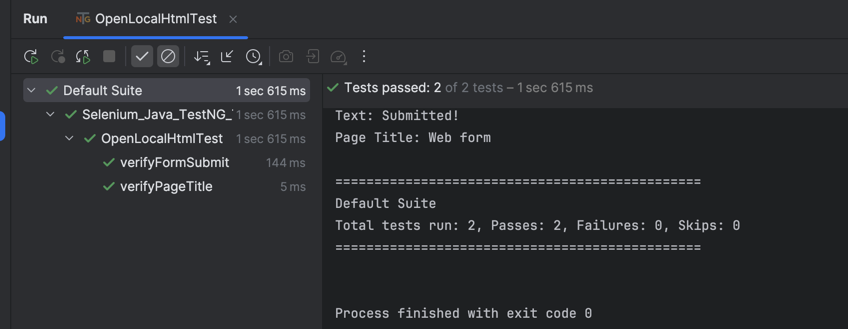

[Selenium](https://www.selenium.dev/) is a powerful open-source framework for automating web browsers for testing web applications.

This repo contains test cases for testing HTML pages, elements and navigations using Selenium with Java binding and [TestNG](https://testng.org/).

This example is using a local HTML document with various elements and styled with CSS and JavaScript.

# Getting started with Selenium
1. Install Java Development Kit.
2. Install an Integrated Development Environment (IDE): this example was created in IntelliJ IDEA.
3. Install a testing framework such as TestNG which is used in this project.
4. Create a new Java project in your IDE and select the build system: this project is using Maven.
5. Add Selenium and TestNG dependencies into `pom.xml` file.
6. Start creating your test classes and Page Object Model (POM) classes.

# About TestNG Annotations
TestNG is a Java testing framework that makes it easier to write, organize, and run automated tests.
TestNG [annotations](https://testng.org/annotations.html) are special markers in Java code that control how your tests and suites are executed. Below are some 
of the examples used in this project:
- `@Test` marks a method as a test
- `@BeforeTest` and `@AfterTest` mark methods that will be executed before and after running all tests within a class
- `@BeforeMethod` and `@AfterMethod` will be executed before and after each test

# How to work with different UI elements
UI automation testing rely on well-defined elements in applications. Selenium offers various [locators](https://www.selenium.dev/documentation/webdriver/elements/) for this purpose, 
including `By.id()`, `By.name()`, `By.xpath()`, `By.cssSelector()`, etc. 
You can use "Inspect" or "View Page Source" option in a browser to determine the ids or names of all elements. 

# Few words about Page Object Model (POM)
The Page Object Model (POM) is a design pattern for creating maintainable, reusable and scalable test automation code.
The best practices for POM:
- Represent each page or a window as a separate class.
- Represent common menus, toolbars and alerts as separate classes as well.
- Define each element once.
- Define user interactions methods - keep them small for better reusability.
- Do not put any business logic into methods: methods should report if an element is visible and test case should determine if this is expected.
- Use meaningful names for elements, methods and test cases.
- Organize your code into an intuitive folder structure and separate POM, data and test suites.
- Add logs into every step.
- Prioritize readability and clarity over slick one-liners.

# Execution and results
You can run your tests directly from the IDE or in a command line using `mvn test`.
For bigger project, you can create `testng.xml` in the root directory and define sets of suites. The execution can also be from the IDE or a command line as mentioned above.
This is an example of how execution results look in IDE:

